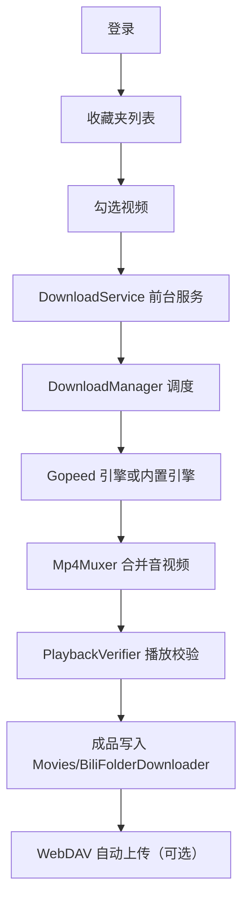

# B站收藏夹下载器（BiliFolderDownloader）

一个 Android 端 B 站收藏夹批量下载工具。登录后可浏览自己的收藏夹，勾选视频批量下载，音视频分轨下载后合并为 MP4 并做播放校验，成品写入公共媒体目录，可选自动上传到 WebDAV。内置下载引擎与 Tinker 热修复。

- 应用名：B站收藏夹下载器
- 包名 / applicationId：`com.bilifolder.downloader`
- 当前版本：`1.0.14`（versionCode 15）

## 功能

- 扫码登录与网页登录，Cookie 持久化到加密存储
- 收藏夹列表与分页拉取，收藏夹内多选视频
- 视频流 + 音频流分别下载，`Mp4Muxer` 合并为 MP4，`PlaybackVerifier` 播放校验
- 下载引擎可选：Gopeed（进程内 native）或内置下载器（OkHttp）
- 断点续传、令牌桶限速、失败重试（5s / 15s / 30s）、临时文件管理
- 网络状态处理：断网暂停、仅 WiFi 模式下等待 WiFi，恢复后自动续传
- 前台服务后台下载，通知栏进度与停止动作
- 下载页展示总体进度与当前文件的字节级进度条
- 成品写入公共 `Movies/BiliFolderDownloader/`，相册与文件管理器可见
- 下载历史、已下载 bvid 去重（bvid 记录 + 文件名双重判断）
- 可选：下载完成后打包 zip 并自动上传 WebDAV，远端确认存在后删除本地 zip
- Tinker 热修复：设置页选择补丁包，合成后重启生效
- 日志：开发版明文导出；正式版导出整体 RSA 加密的日志文件

## 技术栈

| 项目 | 版本 / 说明 |
| --- | --- |
| 语言 | Kotlin 2.1.0，JDK 17 |
| UI | Jetpack Compose + Material 3（Compose BOM 2024.12.01） |
| 构建 | AGP 8.7.3，Gradle 8.14.2 |
| SDK | minSdk 26，targetSdk 35，compileSdk 35 |
| 网络 | OkHttp 4.12.0 |
| 媒体 | AndroidX Media3 1.5.1 |
| 序列化 | kotlinx.serialization 1.7.3 |
| 热修复 | Tinker 1.9.15.1（补丁插件 1.9.15.2） |
| 加密 | BouncyCastle 1.85 |
| 二维码 | ZXing 3.5.3 |
| 测试 | JUnit4、Robolectric、MockWebServer、Compose UI Test |

## 目录结构

```
app/src/main/java/com/bilifolder/downloader/
├── BiliApp.kt              # TinkerApplication 入口
├── BiliAppLike.kt          # Tinker delegate：安装 Tinker、初始化容器、冷启动检查本地补丁
├── MainActivity.kt
├── data/                   # 数据层：BiliApiClient、CookieStore、StorageManager、WebDavClient、记录存储等
│   └── model/Models.kt     # 统一数据模型（EngineProgress、TaskHistory、WebDavConfig 等）
├── engine/                 # 下载引擎：DownloadEngine 接口、Gopeed（进程内）、OkHttp 内置
├── download/               # DownloadManager：分页、过滤、下载、合并、校验、打包上传调度
├── media/                  # Mp4Muxer、PlaybackVerifier、ZipHelper
├── service/                # DownloadService 前台服务
├── ui/                     # AppNavHost、MainViewModel、screens/、theme/
└── util/                   # 日志、调试 db 上传、Tinker 补丁提交
app/src/test/               # 单元测试
app/libs/libgopeed.aar      # Gopeed gomobile 绑定（仅 arm64-v8a）
tools/retrace.py            # R8 mapping 反混淆工具
```

## 下载流程



要点：

- 分片（`*_video.mp4` / `*_audio.mp4`）写入应用专属目录 `getExternalFilesDir(null)/downloads_tmp`，校验通过后删除并触发媒体库扫描。
- 打包默认不做。仅当开启 WebDAV 自动上传且配置完整时，才把本次新增成品打成 zip 上传；上传后用 `PROPFIND` 二次确认远端存在，确认成功才删除本地 zip，失败则保留在 `getExternalFilesDir(null)/zips` 待重试。
- 媒体请求必须携带浏览器 User-Agent 与 `Referer: https://www.bilibili.com/`，否则 CDN 返回 403（见 `MediaRequestHeaders`）。

## 构建

环境要求：

- JDK 17
- Android SDK（compileSdk 35）；SDK 路径写入 `local.properties` 的 `sdk.dir`
- NDK r27c（仅在重新生成 `libgopeed.aar` 时需要），默认路径 `/opt/ndk/android-ndk-r27c`

常用命令：

```bash
# 编译正式版（默认只编 release）
./gradlew :app:assembleRelease

# 编译开发版（仅在需要时）
./gradlew :app:assembleDebug

# 运行单元测试
./gradlew :app:testDebugUnitTest
```

产物位置：

- debug：`app/build/outputs/apk/debug/app-debug.apk`
- release：`app/build/outputs/apk/release/app-release-unsigned.apk`

说明：debug 与 release 都开启 R8 代码裁剪；为满足 Tinker 资源差分要求，`isShrinkResources` 固定为 `false`。

## 签名

当前仓库未配置 release 签名，`assembleRelease` 产出的是未签名 APK，无法直接安装到真机。

签名材料请放在工作区之外或通过 `local.properties` / 环境变量注入，切勿入库。`.gitignore` 已排除 `*.keystore`、`*.jks`、`*.jceks`、`*.p12`、`*.pfx`、`*.key`、`*.pepk`、`keystore.properties`、`signing.properties`、`local.properties` 等。

## Tinker 热修复

- 基准包必须已签名，且新包与线上包的 `tinkerId` 不同（默认取 `versionName`）。
- 生成补丁：

```bash
./gradlew :app:tinkerPatchRelease -PtinkerId=<新版本标识>
```

- 应用补丁：在应用「设置 - 补丁更新」中选择 Tinker 补丁 apk，提交合成后重启应用生效；也可把补丁放到 `filesDir/tinker_local/patch.apk`，冷启动会自动拾取。
- `assembleRelease` 成功后会自动把 release mapping 归档到 `app/build/outputs/mapping/archive/`，用于崩溃堆栈还原。

反混淆崩溃堆栈：

```bash
python3 tools/retrace.py --mapping <mapping.txt> stack.txt
cat stack.txt | python3 tools/retrace.py -m app/build/outputs/mapping/release/mapping.txt
```

## 凭据与隐私

- 源码与 dex 中不含任何明文凭据。
- 开发版调试用 WebDAV 凭据放在 `app/src/debug/assets/debug_webdav.properties`（debug 源集，release 包不含该文件）。脚本 `webdav_123pan.py` 同样含明文凭据，二者均已加入 `.gitignore`，不入库。
- 正式版日志导出使用整体 RSA 加密，logcat 输出在生产构建中关闭。
- 应用不申请 `MANAGE_EXTERNAL_STORAGE`；Android 10 及以下写公共 Movies 目录使用 `WRITE_EXTERNAL_STORAGE`（`maxSdkVersion=29`）。

## 项目文档

- 需求、设计与任务拆解：`.monkeycode/specs/2026-08-18-bilibili-folder-downloader-android/`（`requirements.md`、`design.md`、`tasklist.md`）
- 工程约定与操作记忆：`.monkeycode/MEMORY.md`

## 免责声明

本工具仅用于下载自己账号有权访问的内容，请遵守哔哩哔哩的服务条款与相关法律法规，不得用于侵犯版权或其他商业用途。
